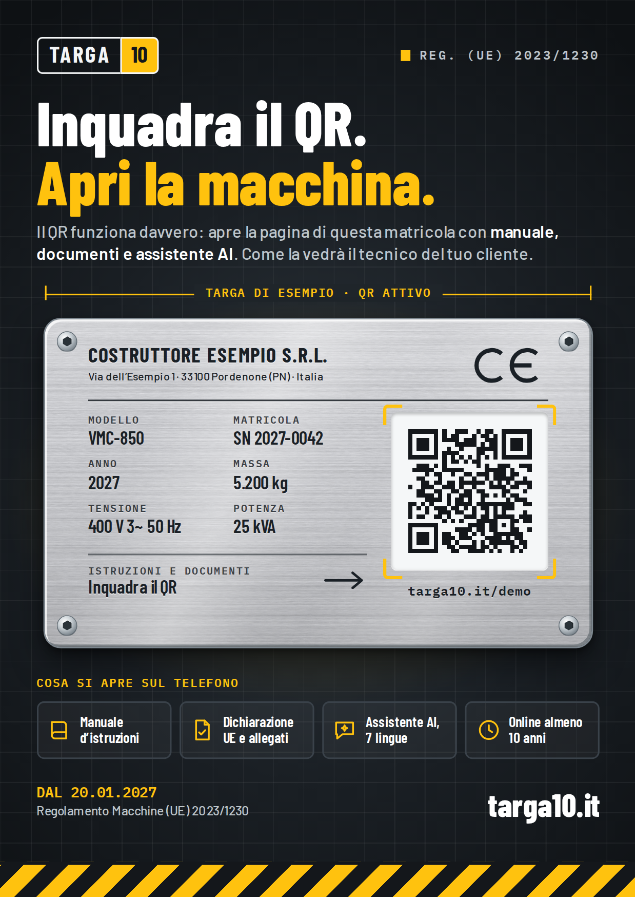
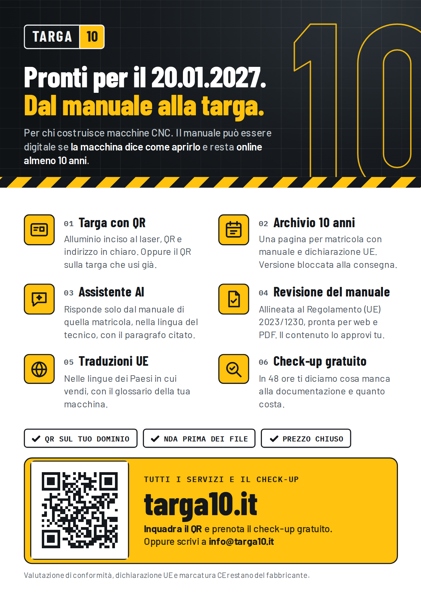

# Flyer A6 Targa10, fronte e retro

Fronte: la targa di esempio con il QR attivo, che apre la pagina della matricola con manuale e documenti.
Retro: i sei servizi e il QR verso il sito.

 

## File da mandare in stampa

| File | Per chi | Formato pagina |
|---|---|---|
| `stampa/Targa10_flyer_A6_fronte-retro_abbondanza-3mm.pdf` | stampa online, copisteria digitale | 111 × 154 mm (A6 + 3 mm di abbondanza), senza crocini |
| `stampa/Targa10_flyer_A6_fronte-retro_con-crocini.pdf` | tipografia che vuole i segni di taglio | 131 × 174 mm, crocini fuori dall'abbondanza |

Pagina 1 = fronte, pagina 2 = retro. Nei PDF sono impostati TrimBox 105 × 148 mm e BleedBox, i font sono incorporati e i QR sono vettoriali.

## Specifiche da dare alla tipografia

- Formato finito: A6, 105 × 148 mm, verticale
- Stampa: fronte e retro a colori (4/4), voltatura sul lato lungo
- Carta: patinata opaca 350 g (va bene anche 300 g)
- Finitura consigliata: plastificazione opaca soft-touch su entrambi i lati. Dà l'effetto premium e protegge il fondo scuro del fronte dai graffi.
- Colori: il file è RGB, la conversione in CMYK la fa la tipografia. La texture metallica della targa è a 400 dpi.

## Dove portano i QR

| Lato | Indirizzo | Cosa apre |
|---|---|---|
| Fronte, sulla targa | `https://targa10.it/demo/` | `../sito/demo/index.html`: pagina della matricola VMC-850 con manuale, documenti, dichiarazione UE e risposte in 7 lingue |
| Retro | `https://targa10.it/` | home del sito con tutti i servizi |

I QR funzionano solo quando targa10.it è online in HTTPS con la cartella `demo/` caricata (vedi `../sito/README.md`).
**Prima di ordinare le copie, inquadra i due QR dal PDF con il telefono e controlla che si aprano le pagine giuste.**

## Rigenerare i PDF

```
npm install
npm run build
pip install pymupdf zxing-cpp pillow
python3 -I tools/verifica.py
```

- Gli indirizzi dei QR sono in cima a `build.mjs`.
- Testi e grafica sono in `src/flyer.html`, con tutte le misure in millimetri.
- `tools/verifica.py` controlla il formato delle pagine, i font incorporati, la risoluzione delle immagini e rilegge i QR dal PDF, anche a bassa risoluzione e sfocati.
- La texture dell'alluminio si rigenera con `python3 tools/alluminio.py`.

Font: Barlow, Barlow Condensed e IBM Plex Mono (SIL Open Font License), in `src/fonts/`.
